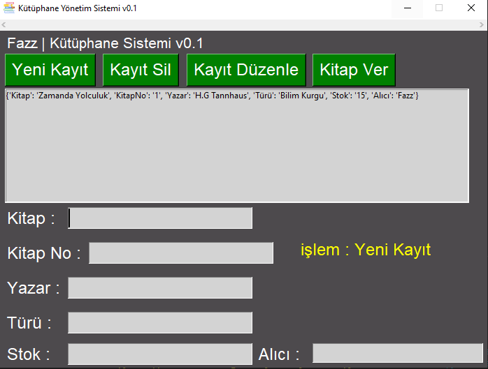

# Fazz | Python Kütüphane Sistemi

Kütüphaneler : **Tkinter, pymongo, time, os** 

Rehber : 

**MongoDB Hesabınızı açın ve Connect butonu ile aldığınız Python linkini Koddaki (Client)'e yapıştırın.** 
**Kullanımı basittir kitap ekliyebilirsiniz, silebilirsiniz ve düzenliyebilirsiniz** 
**Python dosyasının ismini değiştirecek veya programı exeye çevirecek olursanız fonksiyonlarda os.system("main.py") kodunu düzenleyiniz.** 
**Geliştirilmeye devam edecektir...** 

